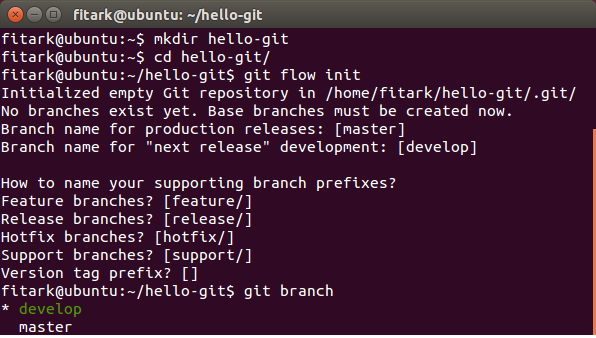
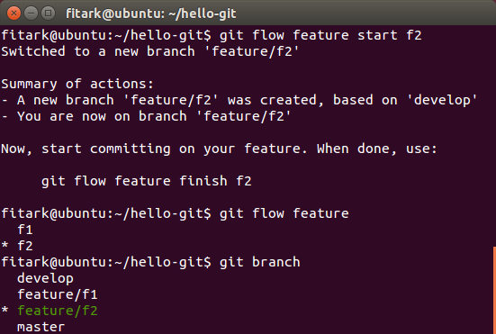
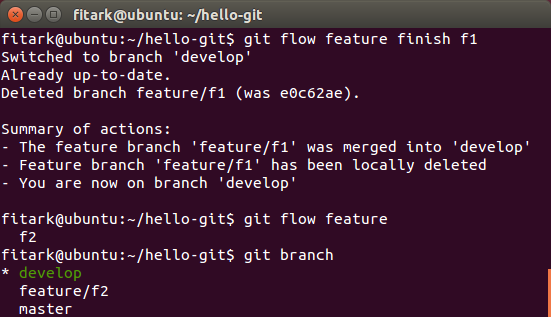

# 基于GitFLow的分支策略及版本控制

如下图所示，[Vincent Driessen分支模型](http://nvie.com/posts/a-successful-git-branching-model/)是一个团队开发时git分支，版本发布，bug修正的策略。这个流程的完整实施需要灵活使用多种指令，不过我们可以采用git-flow来将这个过程变得更加容易一些。 这里先介绍各个分支的含义，通过实例介绍各个指令。

## 1. 分支介绍

### 2.1 主分支

Git里面存在两个平行的主分支

- master ： 一个始终处于`production-ready`状态的主分支
- develop ： 面向下一个`release`的最新开发状态分支，各种自动`nightly builds`在这里执行。

当`develop`分支里的内容达到一个可以稳定发布版本的时候，所有点改动都会被合并到master分支，然后形成一个特定的版本号。

### 2.2 其他分支

团队成员使用一切其他分支来进行并发协作，这些分支生命周期有限，最终将被删除。这些分支都有明确的目的，它们从哪些分支分支出来，最终合并到哪个分支，都有明确的定义。

#### 2.2.1 Feature分支

为了开发未来功能的特性分支，当开发一个新特性时，其准备发布的版本可能是未知的。只要特性在开发，这个分支就存在，最终可能会被merge回develop，或者直接被删除。

- 从哪来：develop
- 到哪去：develop
- 命名：除了master, develop, release-*, or hotfix-* 的任何名称

另外，feature分支一般只在开发者个人`repos`里面，并不会被提交到`origin`。

 新建Feature分支指令

	$ git flow feature start feature-name

 结束Feature分支指令

	$ git flow feature finish feature-name

#### 2.2.2 Release分支

Release分支用来准备下一个产品发布分支，这个分支上可以做一些bug修正和版本号标记。而develop分支则可以用于接受下一个大的发布的Feature。从develop里分出release分支的关键时刻是develop分支几乎已经达到新发布版本预期效果的状态时。至少所有面向新发布版本的Feature需要merge回这个develop分支。 而面向再后面版本的Feature最好等release分支出来以后再合并到develop里面。在Release分支切出来以后，是禁止加入大的Feature的，这些Feature只能merge进入develop。

- 从哪来：develop
- 到哪去：develop 或 master
- 命名：release-*

当这个Release分支即将成为下一个正式发布版时，需要做如下工作

1. Release分支合并回master分支
2. 被提交到master上的提交需要添加一个方便未来引用的版本号。
3. 最后在Release分支里面进行的修改需要被合并回develop分支，这样未来的Release包括这些bug修正。

当最终完成分支以后，可以将Release分支删除，因为不再需要他们了。

#### 2.2.3 Hotfix分支

当有重要bug需要立即修正时，从master分出一个hotfix分支，修正以后再合并回master和develop分支。

- 从哪来：master
- 到哪去：develop 或 master
- 命名：hotfix-*

## 2. 初始化项目相关操作

可以在一个目录里执行`git flow init`，从而初始化项目，并自动生成多个分支。如果这时候执行`git branch`，会看到如下项目自动处于develop分支

	$ git flow init

`develop`分支是日常工作分支，而`master`分支则仅保存可发布状态的版本。 所以这个时候提交代码需要采用如下指令

	$ git push origin develop

## 3. Feature分支相关操作

git-flow使得同时在多个Feature上面工作变得非常方便。 要初始化一个分支可以使用如下指令初始化f1这个feature

	$ git flow feature start f1

如图所示，在feature初始化以后，我们可以通过`git branch`查看到当前处于`feature/f1`这个分支，而通过`git flow feature`这个指令我们可以看到目前总共有一个feature分支`f1`

我们可以再创一个`f2`分支，并查看如下

当完成一个Feature的时候，可以通过如下执行执行

	$ git flow feature finish f1

执行结果如图所示，我们注意到`f1`的内容已经被合并到`develop`分支，而本地的`f1`分支也被删掉，最后项目切换到了`develop`分支

总结一下，要list/start/finish Feature分支，可以使用如下指令，这里的[base]参数必须是develop分支上的一个commit

	git flow feature
	git flow feature start <name> [<base>]
	git flow feature finish <name>

要push/pull 远端服务器的一个Feature分支，可以使用如下执行

	git flow feature publish <name>
	git flow feature pull <remote> <name>

##  Release分支相关操作

当准备发布一个新版本时可以使用如下指令

	$ git flow release start 0.1.0

结果如下图所示，我们看到创建了一个`release/0.1.0`分支，并且切换到这个分支，

完成这个分支以后执行如下指令

	$ git flow release finish 0.1.0	

如图所示，这个指令完成了如下事情

- 将`release/0.1.0`分支合并进master
- 在release上tag 'v0.1.0'
- 删除本地的`release/0.1.0`分支删除
- 最后切换到`master`分支

总结一下，要list/start/finish Release分支，则使用如下指令，这里的[base]参数必须是develop分支上的一个commit

	git flow release
	git flow release start <release> [<base>]
	git flow release finish <release>

##  hotfix 分支相关操作

要list/start/finish Hotfix分支，则使用如下指令，这里的[base]参数必须是develop分支上的一个commit

	git flow hotfix
	git flow hotfix start <release> [<base>]
	git flow hotfix finish <release>

